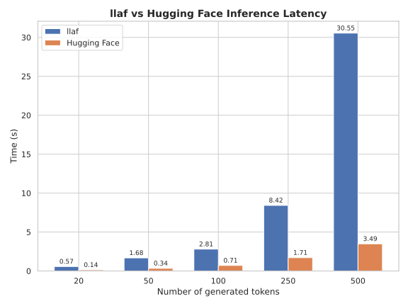

# GPT-2 Inference

This example demonstrates how to invoke llaf from Python to produce text using GPT-2. It supports pre-trained Hugging Face models, whose parameters are appropriately reshaped for llaf on the first use and saved as `.npz` files. Please follow these instructions to run the model:

1. Make sure the appropriate drivers are installed on your system.
2. Navigate to this directory.
3. Install the required dependencies: `pip install -r requirements.txt`.
4. Compile `llm.fut` to a server-mode executable: `futhark cuda --server ../../src/llm.fut -o llm`. You can use other backends instead of `cuda`, e.g., `opencl` or `hip`.
5. Run the inference script with your desired prompt: `python main.py "Prompt goes here"`.
    * Arguments:
      * `--name`: GPT-2 variant to use.
          * Options are `gpt2`, `gpt2-medium`, `gpt2-large`, and `gpt2-xl`.
      * `--cnt`: Number of additional tokens to generate.
      * `--benchmark`: Flag for benchmarking llaf against Hugging Face.
      * `--dump DIR`: Flag for dumping Futhark-readable data files to this directory.

With the initial prompt of `Once upon a time`, laff can be anywhere from 3x to 10x slower than the Hugging Face implementation of GPT-2 on an RTX 2070 GPU, as seen below. This benchmark was run using OpenCL, which was on par with the CUDA backend on this hardware. Despite its poor relative performance, the Futhark compiler still does a decent job, especially considering that it's aimed towards general array computations and isn't optimized for deep learning.

  

